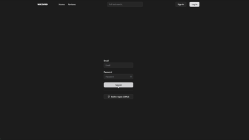
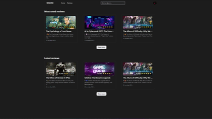

# 🗂 BlogApp-Ultra Backend

> **Русский:** Платформа для рецензий на фильмы, книги и мультфильмы с поддержкой markdown-разметки, комментариев, лайков и рейтингов. Встроенная админ-панель обеспечивает управление пользователями и контентом.

> **English:** A review platform for movies, books, and animations with markdown support, comments, likes, and ratings. The integrated admin panel enables full control over users and content.

---

## 🎬 Демонстрация функций / Project Demo

| GIF                                           | Описание / Description |
|-----------------------------------------------|------------------------|
|            | 🇷🇺 OAuth авторизация.    🇺🇸 OAuth authorization. |
|  | 🇷🇺 Основной обзор приложения: главная панель управления, страницы рецензий, комментариев и пользователей.   🇺🇸 Main overview of the app: dashboard, review pages, comments, and user management. |
|  | 🇷🇺 Создание комментариев и лайков с мгновенной синхронизацией через WebSocket.    🇺🇸 Adding comments and likes with real-time synchronization via WebSocket. |
|  | 🇷🇺 Управление рецензиями и пользователями: редактирование, сортировка и навигация по разделам.    🇺🇸 Managing reviews and users: editing, sorting, and navigating through sections. |
|  | 🇷🇺 Создание новой рецензии с поддержкой markdown и загрузки изображений.    🇺🇸 Creating a new review with markdown support and image upload. |

## 🔹 Полное описание / Full Description

🇷🇺 Русский:
> Фронтенд ReviewApp реализован на Next.js с использованием TypeScript и Tailwind CSS. Поддерживает современный дизайн, адаптивный интерфейс и удобный пользовательский опыт. В приложении доступны: создание и редактирование рецензий с поддержкой markdown, загрузка изображений, система комментариев и лайков с синхронизацией в реальном времени через WebSocket. Реализованы тёмная/светлая темы, локализация интерфейса и анимации для плавного UX.

🇺🇸 English:
> The ReviewApp frontend is built with Next.js, TypeScript, and Tailwind CSS. It delivers a modern design, responsive UI, and smooth user experience. Features include creating and editing reviews with markdown support, image uploads, comments and likes with real-time WebSocket synchronization. The app supports light/dark themes, interface localization, and animated transitions for enhanced UX
---

## 📌 Основные фичи / Features

🇷🇺 Русский:

📝 Рецензии: создание, редактирование и удаление с markdown-редактором  
🖼 Загрузка изображений в рецензии и аватары пользователей 
💬 Комментарии с редактированием и удалением 
👍 Лайки для рецензий и комментариев 
🔄 Реальное время: обновление лайков и комментариев через WebSocket 
🎨 Темы: светлая и тёмная, переключение в интерфейсе 
🌍 Локализация (i18n) интерфейса 
⚡ Быстрый отклик благодаря React Query (кеширование и синхронизация данных) 
🎭 Анимации и плавные переходы через Framer Motion 
🔔 Уведомления через библиотеку Sonner 
📱 Полностью адаптивный интерфейс 

🇺🇸 English:

📝 Reviews: create, edit, and delete with a markdown editor 
🖼 Image upload for reviews and user avatars 
💬 Comments with edit and delete options 
👍 Likes for reviews and comments 
🔄 Real-time updates of likes and comments via WebSocket 
🎨 Themes: light & dark, switchable in UI 
🌍 Interface localization (i18n) 
⚡ Fast responses with React Query (caching and data sync) 
🎭 Animations and smooth transitions with Framer Motion 
🔔 Notifications powered by Sonner 
📱 Fully responsive design 

---

## 🛠 Технологии / Technologies & Tools

| Компонент / Component          | Технология / Technology                           |
| ------------------------------ | ------------------------------------------------- |
| 🌐 Фреймворк / Framework       | Next.js (App Router)                              |
| ⚛️ UI & State                  | React, React Hook Form, Zod                       |
| 🎨 Стили / Styling             | Tailwind CSS, tailwind-merge, clsx                |
| 📝 Markdown Editor             | @uiw/react-md-editor, @uiw/react-markdown-preview |
| ⚡ Data fetching & Caching      | React Query (@tanstack)                           |
| 🔄 Реальное время / Real-time  | Socket.IO client                                  |
| 🎭 Анимации / Animations       | Framer Motion, tw-animate-css                     |
| 🎨 UI-компоненты               | Radix UI (Dropdown, Dialog, Tooltip, etc.)        |
| 🌍 Темы и i18n                 | next-themes, локализация                          |
| 🔔 Уведомления / Notifications | Sonner                                            |
| 📡 API-запросы                 | Axios                                             |
| 🛡 Валидация / Validation      | React Hook Form, Zod                              |
| ⚙️ Дополнительно / Additional  | Lucide React (icons)                              |

